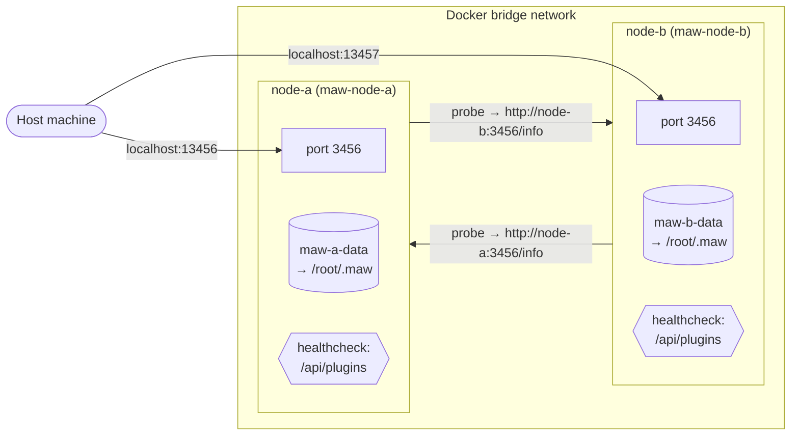

# Federation testing in Docker

Reproduce a GitHub-Actions-like environment locally: two maw-js
containers on a shared Docker network, handshaking as peers.

## Topology



Host ports `13456` / `13457` map to each container's `3456`. Inside the
bridge network, containers reach each other by hostname (`node-a`,
`node-b`) via Docker's embedded DNS — no `localhost` shortcut, so peer
handshake bugs surface the same way they would across real hosts.

## Why this exists

Peer handshake bugs only surface across real network boundaries — on a
single host everything talks via `localhost` and subtle URL / DNS /
CORS issues hide. Running two containers behind Docker's internal DNS
gives us a cheap, reproducible 2-node cluster that mirrors what CI and
production peer pairs actually see.

## Run it locally

```bash
# One-shot: build + up + probe + teardown
bash scripts/test-docker-federation.sh

# Or step-through (leaves containers running):
bash scripts/dev-federation.sh up
docker compose -f docker/compose.yml exec node-a maw peers probe peer
docker compose -f docker/compose.yml exec node-b maw peers probe peer
bash scripts/dev-federation.sh down
```

Requires Docker Engine 24+ and `docker compose` v2.

## Expected output

```
--- probe a → b ---
probing peer → http://node-b:3456 ...
✓ reached peer (node-b)
--- probe b → a ---
probing peer → http://node-a:3456 ...
✓ reached peer (node-a)

## Docker federation probe result
- a → b: PASS, code: 0, hint: -
- b → a: PASS, code: 0, hint: -

OK: both directions passed
```

The script exits `0` only if both probe calls exit `0` **and** the
output contains no `handshake failed` substring. Any other shape is a
regression.

Last verified end-to-end on 2026-04-19 against `main` at
[`76e1db1`](https://github.com/Soul-Brews-Studio/maw-js/commit/76e1db1) —
both directions PASS once the bind heuristic from
[#619](https://github.com/Soul-Brews-Studio/maw-js/pull/619) (closes
[#616](https://github.com/Soul-Brews-Studio/maw-js/issues/616)) is in
place.

## Debugging failures

1. Re-run with the stack left up: `bash scripts/dev-federation.sh up`
2. Shell into a node: `docker compose -f docker/compose.yml exec node-a sh`
3. Inspect logs: `docker compose -f docker/compose.yml logs node-a node-b`
4. Check healthchecks: `docker compose -f docker/compose.yml ps`
5. Manual probe inside a node: `maw peers probe peer`

On CI, the `Federation (Docker) integration` workflow uploads compose
logs as a `federation-docker-logs` artifact when the job fails.

## Known gaps

- **Historical (resolved, #596 / #603):** `maw-js` did not register a
  `/info` endpoint, so `src/commands/plugins/peers/probe.ts` surfaced
  `HTTP_4XX` against any currently-built image. The probe round-trip was
  still useful for catching transport / DNS / compose-wiring regressions,
  but the handshake classifier stayed red until `/info` shipped. Tracking
  issue: [#596](https://github.com/Soul-Brews-Studio/maw-js/issues/596)
  (closed by [#603](https://github.com/Soul-Brews-Studio/maw-js/pull/603)).
- **Historical (resolved, #607 / #614):** the image build failed at
  `bun install --frozen-lockfile` when the committed `bun.lock` was
  written by a bun version older than the one resolved by
  `oven/bun:1.3-alpine`. Aligning the Dockerfile to the lockfile's bun
  version unblocked the harness.
- **Historical (resolved, #616 / #619):** `maw serve` defaulted to
  binding `127.0.0.1` only, so cross-container probes resolved DNS but
  hit `REFUSED` on connect. The bind heuristic now upgrades to `0.0.0.0`
  when `MAW_HOST` is set or when `peers.json` exists, which is what the
  compose entrypoint provides.

## Related

- `docker/Dockerfile` — the `maw-js:test` image (single-stage, bun-alpine)
- `docker/compose.yml` — 2-node wiring with mutual `PEER_URL`s
- `scripts/dev-federation.sh` — local up/down helper
- `scripts/test-docker-federation.sh` — end-to-end probe driver
- `.github/workflows/federation-docker.yml` — CI wrapper
